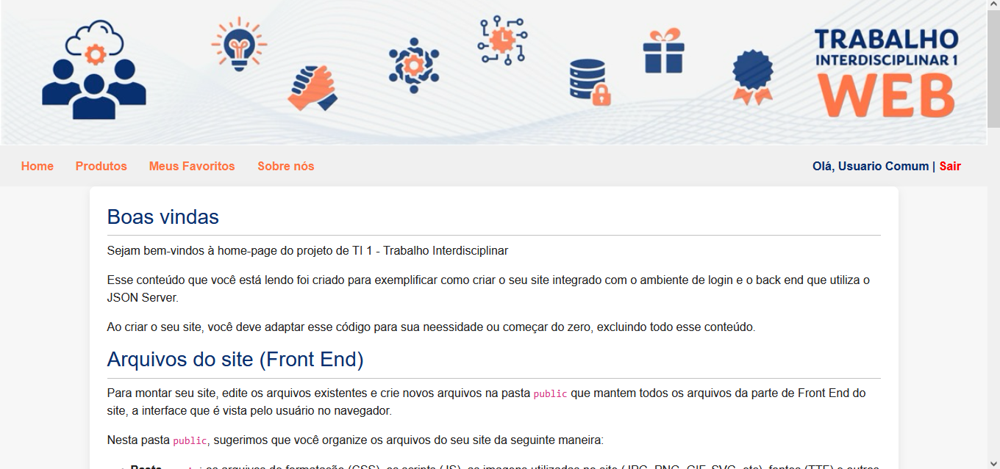
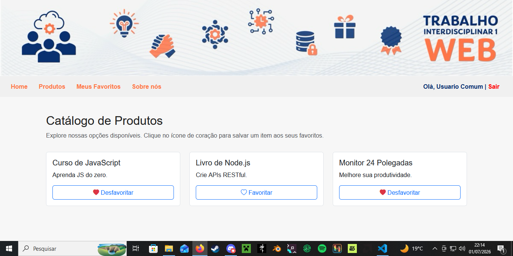
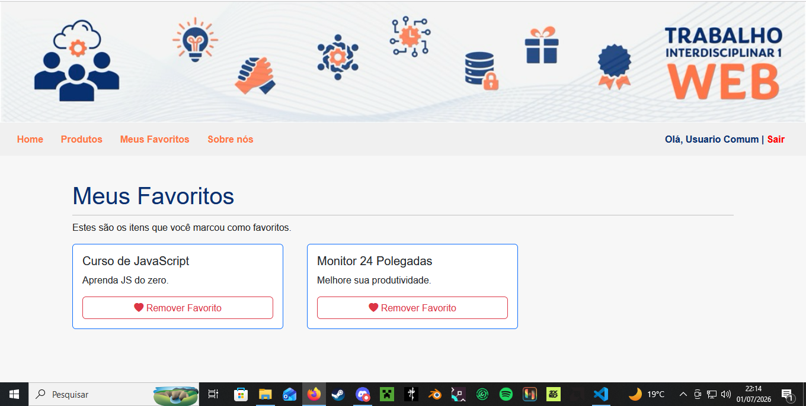

# Projeto: Integração de Login e Personalização

**Aluno:** Miguel Abood

## Evidências da Implementação

**1. Home mostrando usuário logado (“Olá, <nome> | Sair”):**

**2. A funcionalidade funcionando (itens favoritados na home/produtos):**

**3. Página “Meus Favoritos” com itens salvos para o usuário logado:**
